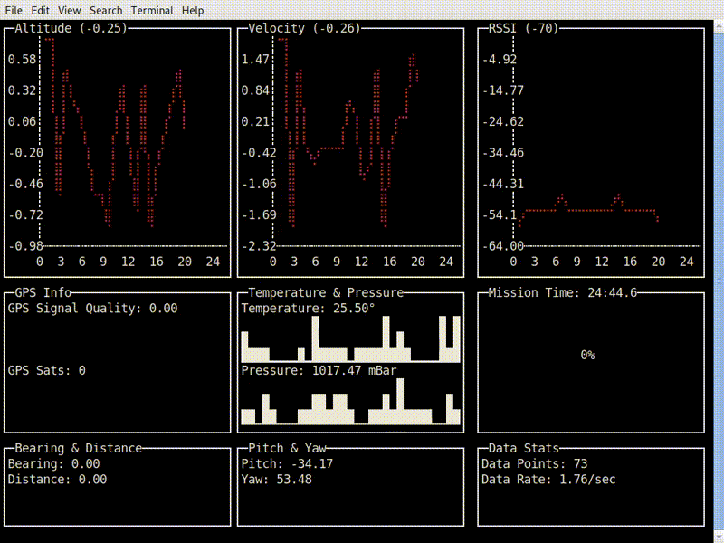
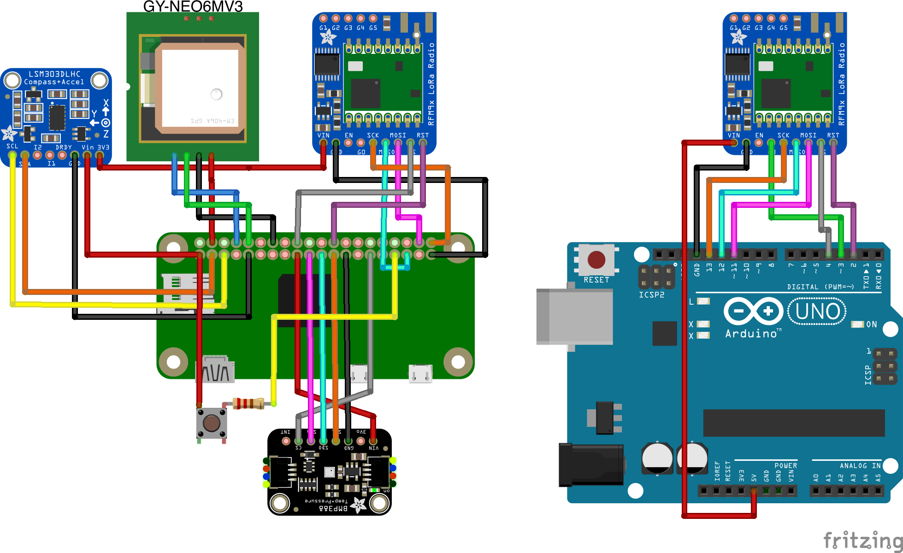

# White Vest

[](https://travis-ci.org/johnjones4/white-vest)



White Vest is a project for collecting, logging, emitting, and visualizing telemetry from a model rocket containing an inboard Raspberry Pi Zero with another Raspberry Pi receiving telemetry. To learn more about this project, visit my [blog post](https://johnjonesfour.com/2020/10/03/model-rocket-telemetry-part-1/) documenting it. This project is named after the iconic [white vest that flight director Gene Kranz wore during Apollo 13](https://airandspace.si.edu/stories/editorial/gene-kranz%E2%80%99s-apollo-13-vest). 

## Hardware

This project requires two Raspberry Pis: one for inboard the rocket, ideally a Pi Zero, and one for ground telemetry reception.

### Inboard 

The inboard system records video and measures pressure, temperature, altitude, acceleration, and orientation. The total payload weight of the module, with 3D printed parts for mounting, weights about 115 grams, but your mileage may vary.

* [Raspberry Pi Zero W](https://www.adafruit.com/product/3400)
* [Lithium Ion Cylindrical Battery - 3.7v 2200mAh](https://www.adafruit.com/product/1781)
* [PowerBoost 500 Basic - 5V USB Boost @ 500mA from 1.8V+](https://www.adafruit.com/product/1903)
* [Adafruit RFM95W LoRa Radio Transceiver Breakout - 868 or 915 MHz - RadioFruit](https://www.adafruit.com/product/3072)
* [Adafruit BMP388 - Precision Barometric Pressure and Altimeter](https://www.adafruit.com/product/3966)
* [Zero Spy Camera for Raspberry Pi Zero](https://www.adafruit.com/product/3508)
* [Triple-axis Accelerometer+Magnetometer (Compass) Board - LSM303](https://www.adafruit.com/product/1120)
* [GPS Module](https://www.amazon.com/gp/product/B084MK8BS2/ref=ppx_yo_dt_b_asin_title_o00_s00?ie=UTF8&psc=1)

### Ground

* [Raspberry Pi Zero W](https://www.adafruit.com/product/3400)
* [Adafruit RFM95W LoRa Radio Transceiver Breakout - 868 or 915 MHz - RadioFruit](https://www.adafruit.com/product/3072)
* [GPS Module](https://www.amazon.com/gp/product/B084MK8BS2/ref=ppx_yo_dt_b_asin_title_o00_s00?ie=UTF8&psc=1)

### Wiring



The air hardware is wired to the following Raspberry Pi pins:

* **PowerBoost 500 Basic:**
  * 5v -> Pi 5V
  * Ground -> Pi Ground
* **BMP388 (SPI 0)**
  * VIN -> Pi 3V
  * GND -> Pi GND
  * SCK -> Pi SCLK
  * SDI -> Pi MOSI
  * SDO -> Pi MISO
  * CS -> D5
* **LSM303 (I2C)**
  * VIN -> Pi 3V
  * GND -> Pi GND
  * SCL -> Pi SCL
  * SDA -> Pi SDA
* **Camera**
  * Pi Camera ribbon connection
* **RFM95W (SPI 1)**
  * VIN -> Pi 3V
  * GND -> Pi GND
  * SCK -> Pi SPI1 SCLK
  * SDI -> Pi SPI1 MOSI
  * SDO -> Pi SPI1 MISO
  * CS -> Pi D24
  * RST -> CE0
* **GPS Module (Serial)**
  * VIN -> Pi 5V
  * GND -> Pi GND
  * TX -> Pi RX
  * RX -> Pi TX

The ground hardware, much more simply, is wired to the following Raspberry Pi pins:

* **RFM95W (SPI 1)**
  * VIN -> Pi 3V
  * GND -> Pi GND
  * SCK -> Pi SCLK
  * SDI -> Pi MOSI
  * SDO -> Pi MISO
  * CS -> Pi CE1
  * RST -> Pi D25
* **GPS Module (Serial)**
  * VIN -> Pi 5V
  * GND -> Pi GND
  * TX -> Pi RX
  * RX -> Pi TX

## Software


### Air

The air software logs all sensor readings to a timestamped CSV file under `data` and transmits them using a LoRA transceiver, and data logging cuts off after 30 minutes. The transmitted data is a simple binary sequence of doubles in the following order:

* Unix Timestamp
* Barometric Pressure (Pascals)
* Temperature (Celsius)
* Acceleration X (M/s/s)
* Acceleration Y (M/s/s)
* Acceleration Z (M/s/s)
* Magnetic Direction X (Degrees)
* Magnetic Direction Y (Degrees)
* Magnetic Direction Z (Degrees)
* Latitude
* Longitude
* GPS Signal Quality
* Number of GPS sats

### Ground

The ground software listens for transmitted data packets from air and also logs that data to a timestamped CSV file under `data`. It also exposes port 8000 as a webserver to access the telemetry dashboard. That is usually available at `http://localhost:8000/dashboard/`. It should begin picking up telemetry after a few minutes.

### Installation

This software requires [I2C](https://learn.adafruit.com/adafruits-raspberry-pi-lesson-4-gpio-setup/configuring-i2c), [SPI0](https://www.raspberrypi-spy.co.uk/2014/08/enabling-the-spi-interface-on-the-raspberry-pi/), SPI1, and [Serial](https://maker.pro/raspberry-pi/tutorial/how-to-use-a-gps-receiver-with-raspberry-pi-4) to be enabled on a Raspberry Pi. (To enable SPI1, add `dtoverlay=spi1-3cs` to the file `/boot/config.txt`.)

To install this software on a Raspberry Pi, execute the following:

```bash
$ cd ~
$ git clone git@github.com:johnjones4/white-vest.git
$ cd white-vest
$ make install
```

Then, depending upon whether you are setting up the ground module, run `make install-air` or `make install-ground`.

To start the software in the foreground, run either `make air` or `make ground`.

To start the software in the background, run either `sudo systemctl start air` or `sudo systemctl start ground`.
